# Stock Pipeline Architecture

## System Overview

Real-time crypto data ingestion → Kafka streaming → S3 data lake → Spark batch processing → LSTM training → Live inference → Streamlit dashboard.

---

## Full Architecture Diagram

```mermaid
flowchart TB
    %% ─────────────────────────────────────────────
    %% EXTERNAL DATA SOURCE
    %% ─────────────────────────────────────────────
    subgraph EXT["☁️  External — Polygon.io WebSocket API"]
        POLY_TRADES["Trades Feed\n(BTC, ETH, SOL\ncrypto-prices)"]
        POLY_OB["Orderbook Feed\n(bids & asks\ncrypto-orderbook)"]
    end

    %% ─────────────────────────────────────────────
    %% INGESTION LAYER
    %% ─────────────────────────────────────────────
    subgraph INGEST["🐳 Docker — Ingestion Layer"]
        P1["producer\n─────────────\nWebSocket client\nPublishes trade events\n(price, size, timestamp,\ntrade_id, symbol)"]
        P2["producer2\n─────────────\nWebSocket client\nPublishes orderbook snapshots\n(bids[], asks[],\nbid_ask_ratio, spread)"]
    end

    POLY_TRADES -->|WebSocket| P1
    POLY_OB -->|WebSocket| P2

    %% ─────────────────────────────────────────────
    %% KAFKA BROKER
    %% ─────────────────────────────────────────────
    subgraph KAFKA["🐳 Docker — Apache Kafka (KRaft mode, single broker)"]
        T1[["Topic: crypto-prices\n(partition=1, retention=7d)"]]
        T2[["Topic: crypto-orderbook\n(partition=1, retention=7d)"]]
        T3[["Topic: crypto-prices-dlq\n(dead-letter queue)"]]
        T4[["Topic: crypto-orderbook-dlq\n(dead-letter queue)"]]
        T5[["Topic: crypto-predictions\n(partition=1)"]]
    end

    P1 -->|produce| T1
    P2 -->|produce| T2

    %% ─────────────────────────────────────────────
    %% CONSUMER LAYER
    %% ─────────────────────────────────────────────
    subgraph CONSUMERS["🐳 Docker — Stream Consumers"]
        CP["consumer-prices\n─────────────\nKafka consumer group\nBatch flush → S3\n(JSON per record)"]
        CO["consumer-orderbook\n─────────────\nKafka consumer group\nBatch flush → S3\n(JSON per record)"]
        CDLQ1["consumer-prices-dlq\n─────────────\nDead-letter handler\nLogs & stores failed msgs"]
        CDLQ2["consumer-orderbook-dlq\n─────────────\nDead-letter handler\nLogs & stores failed msgs"]
    end

    T1 -->|consume| CP
    T2 -->|consume| CO
    T3 -->|consume| CDLQ1
    T4 -->|consume| CDLQ2

    %% ─────────────────────────────────────────────
    %% S3 DATA LAKE
    %% ─────────────────────────────────────────────
    subgraph S3["☁️  AWS S3 — Data Lake (eu-north-1)"]
        direction TB
        subgraph RAW["raw/ — Landing Zone"]
            R1["raw/prices/\ndate=YYYY-MM-DD/\n*.json.gz"]
            R2["raw/orderbook/\ndate=YYYY-MM-DD/\n*.json.gz"]
        end
        subgraph PROC["processed/ — Curated Zone"]
            PR1["processed/merged/\ndate=YYYY-MM-DD/\n*.parquet\n(prices + orderbook merged)"]
            PR2["processed/joined/\n*.parquet\n(prices LEFT JOIN orderbook\non symbol+timestamp)"]
            PR3["processed/daily/\n*.parquet\n(15 engineered features\nper trade)"]
            PR4["processed/training/\n*.parquet\n(cleaned, limited to\n10k rows/symbol)"]
        end
        subgraph MODELS["processed/models/ — Model Registry"]
            direction LR
            MB["BTCUSDT/\n20260408_020250/\n├─ model.keras\n├─ feature_scaler.joblib\n├─ price_scaler.joblib\n└─ metrics.json"]
            ME["ETHUSDT/\n20260408_020347/\n├─ model.keras\n├─ feature_scaler.joblib\n├─ price_scaler.joblib\n└─ metrics.json"]
            MS["SOLUSDT/\n20260408_020443/\n├─ model.keras\n├─ feature_scaler.joblib\n├─ price_scaler.joblib\n└─ metrics.json"]
        end
    end

    CP -->|"flush batch (S3A)"| R1
    CO -->|"flush batch (S3A)"| R2

    %% ─────────────────────────────────────────────
    %% SPARK CLUSTER
    %% ─────────────────────────────────────────────
    subgraph SPARK["🐳 Docker — Apache Spark Standalone Cluster"]
        SM["spark-master\n:8080 UI  :7077 RPC\n─────────────\nCluster coordinator\nAccepts job submissions"]
        SW["spark-worker\n─────────────\n2 CPU cores / 2 GB RAM\nExecutes task partitions"]
        SM <-->|"worker registration\n& heartbeat"| SW
    end

    subgraph SPARK_JOBS["Spark Jobs (PySpark, run via SparkSubmitOperator)"]
        J1["merge_raw.py\n─────────────\nReads raw/prices/ + raw/orderbook/\nCoerces schema, deduplicates\nWrites → processed/merged/"]
        J2["join_topics.py\n─────────────\nLeft joins prices ⟕ orderbook\non symbol + timestamp window\nWrites → processed/joined/"]
        J3["feature_engineering.py\n─────────────\nComputes 15 features:\nprice_lag_1/5/10, price_change,\nprice_change_pct, rolling_avg_5/10,\nrolling_stddev_10, volume_change,\nspread, bid_ask_ratio,\ntotal_bid/ask_volume\nWrites → processed/daily/"]
        J4["prepare_training.py\n─────────────\nSelects feature cols\nLimits to 10k rows/symbol\n(most recent by timestamp)\nDrops critical nulls\nFills remaining nulls → 0\nWrites → processed/training/"]
    end

    J1 --> J2 --> J3 --> J4

    %% ─────────────────────────────────────────────
    %% AIRFLOW ORCHESTRATION
    %% ─────────────────────────────────────────────
    subgraph AIRFLOW["🐳 Docker — Apache Airflow (SequentialExecutor + SQLite)"]
        direction TB
        AW["airflow-webserver\n:8081\n─────────────\nDAG browser, trigger UI\nlog viewer"]
        AS["airflow-scheduler\n─────────────\nPolls SQLite for due tasks\nSubmits to executor"]
        AI["airflow-init\n─────────────\nOne-shot container:\ndb init + admin user +\nspark_default connection"]

        subgraph DAG1["DAG: daily_processing (scheduled: daily)"]
            D1A["merge_raw\nSparkSubmitOperator"]
            D1B["join_topics\nSparkSubmitOperator"]
            D1C["feature_engineering\nSparkSubmitOperator"]
            D1D["prepare_training\nSparkSubmitOperator"]
            D1A --> D1B --> D1C --> D1D
        end

        subgraph DAG2["DAG: ml_retraining (triggered after daily_processing)"]
            D2A["train_lstm\nDockerOperator\n─────────────\nimage: stock-pipeline-ml\ncmd: python train.py\nmounts: ~/.aws → /root/.aws\nsocket: /var/run/docker.sock"]
        end

        AS -->|"schedule & execute"| DAG1
        AS -->|"trigger on success"| DAG2
    end

    AW <-->|SQLite| AS
    AI -->|"init DB"| AS

    %% ─────────────────────────────────────────────
    %% ML TRAINING
    %% ─────────────────────────────────────────────
    subgraph ML["🐳 Docker — ML Training Container (stock-pipeline-ml)"]
        direction TB
        TR["train.py\n─────────────\nFor each symbol:\n1. Read processed/training/ from S3\n2. Sort by timestamp\n3. Scale features: MinMaxScaler\n4. Scale price: MinMaxScaler\n5. Build sequences (window=60)\n6. Train LSTM:\n   Layer 1: LSTM(64, return_sequences=True)\n   Layer 2: LSTM(32)\n   Layer 3: Dense(16, relu)\n   Output:  Dense(1, linear)\n7. Compile: Adam + MSE loss\n8. Fit: 2 epochs, batch=32\n9. Save model.keras + scalers → S3"]
    end

    %% ─────────────────────────────────────────────
    %% PREDICTOR (INFERENCE)
    %% ─────────────────────────────────────────────
    subgraph PRED["🐳 Docker — Predictor (Real-time Inference)"]
        direction TB
        PR["predictor.py\n─────────────\nStartup:\n  Load latest model.keras\n  Load feature_scaler.joblib\n  Load price_scaler.joblib\n  (per symbol from S3)\n\nRuntime (per trade message):\n  1. Consume crypto-prices (price, size)\n  2. Consume crypto-orderbook (spread,\n     bid_ask_ratio, volumes) via dict\n  3. Compute 15 features in-memory:\n     lags, rolling stats, volume delta\n  4. Append to rolling deque(maxlen=70)\n  5. When buffer ≥ 60:\n     - Scale with feature_scaler\n     - Slice last 60 rows → sequence\n     - model.predict(sequence)\n     - Inverse-transform with price_scaler\n  6. Publish to crypto-predictions"]
    end

    %% ─────────────────────────────────────────────
    %% FRONTEND
    %% ─────────────────────────────────────────────
    subgraph FE["🐳 Docker — Frontend (Streamlit :8502)"]
        direction TB
        APP["app.py\n─────────────\nBackground threads:\n  Thread A: consume crypto-prices\n            → deque(maxlen=200) per symbol\n  Thread B: consume crypto-predictions\n            → deque(maxlen=200) per symbol\n\nUI (auto-refresh every 1s):\n  Per symbol tab:\n    • Live price metric\n    • Predicted price metric + delta\n    • Direction badge (UP/DOWN)\n    • Dual-line chart:\n        — Actual Price\n        — Predicted Price\n    • Last 10 predictions table"]
    end

    %% ─────────────────────────────────────────────
    %% DATA FLOW CONNECTIONS
    %% ─────────────────────────────────────────────

    %% S3 raw → Spark
    R1 & R2 -->|"s3a:// read\n(hadoop-aws-3.3.4)"| J1

    %% Spark reads/writes within S3
    J1 -->|"s3a:// write"| PR1
    PR1 -->|"s3a:// read"| J2
    J2 -->|"s3a:// write"| PR2
    PR2 -->|"s3a:// read"| J3
    J3 -->|"s3a:// write"| PR3
    PR3 -->|"s3a:// read"| J4
    J4 -->|"s3a:// write"| PR4

    %% Spark jobs run on cluster
    J1 & J2 & J3 & J4 -->|"submit via\nsparkSubmit"| SM

    %% Airflow submits Spark jobs
    DAG1 -->|"SparkSubmitOperator\n(spark://spark-master:7077)"| SPARK_JOBS

    %% Airflow triggers ML via Docker socket
    DAG2 -->|"DockerOperator\n(docker.sock)"| ML

    %% ML reads training data, writes models
    PR4 -->|"boto3 s3.get_object"| TR
    TR -->|"boto3 s3.put_object\n(model + scalers)"| MODELS

    %% Predictor loads models, reads live data, publishes
    MODELS -->|"boto3 download\non startup"| PR
    T1 -->|"consume"| PR
    T2 -->|"consume"| PR
    PR -->|"produce"| T5

    %% Frontend consumes live + predictions
    T1 -->|"consume"| APP
    T5 -->|"consume"| APP

    %% ─────────────────────────────────────────────
    %% USER / BROWSER
    %% ─────────────────────────────────────────────
    USER["👤 User Browser\nlocalhost:8502"]
    APP -->|"HTTP Streamlit"| USER

    %% ─────────────────────────────────────────────
    %% STYLES
    %% ─────────────────────────────────────────────
    classDef external fill:#e8f4f8,stroke:#2196F3,stroke-width:2px,color:#000
    classDef kafka fill:#fff3e0,stroke:#FF9800,stroke-width:2px,color:#000
    classDef spark fill:#fce4ec,stroke:#E91E63,stroke-width:2px,color:#000
    classDef airflow fill:#f3e5f5,stroke:#9C27B0,stroke-width:2px,color:#000
    classDef s3 fill:#e8f5e9,stroke:#4CAF50,stroke-width:2px,color:#000
    classDef ml fill:#fff8e1,stroke:#FFC107,stroke-width:2px,color:#000
    classDef pred fill:#e3f2fd,stroke:#1565C0,stroke-width:2px,color:#000
    classDef fe fill:#f1f8e9,stroke:#558B2F,stroke-width:2px,color:#000
    classDef user fill:#fafafa,stroke:#607D8B,stroke-width:2px,color:#000

    class EXT,POLY_TRADES,POLY_OB external
    class KAFKA,T1,T2,T3,T4,T5 kafka
    class SPARK,SM,SW,SPARK_JOBS,J1,J2,J3,J4 spark
    class AIRFLOW,AW,AS,AI,DAG1,DAG2,D1A,D1B,D1C,D1D,D2A airflow
    class S3,RAW,PROC,MODELS,R1,R2,PR1,PR2,PR3,PR4,MB,ME,MS s3
    class ML,TR ml
    class PRED,PR pred
    class FE,APP fe
    class USER user
```



---

## Component Summary

| Component | Image / Build | Port | Role |
|---|---|---|---|
| **kafka** | `confluentinc/cp-kafka:7.7.0` | 9092 | KRaft broker — all topic I/O |
| **producer** | `./producer` | — | Streams live trade events to `crypto-prices` |
| **producer2** | `./producer2` | — | Streams orderbook snapshots to `crypto-orderbook` |
| **consumer-prices** | `./consumer` | — | Persists trade events to S3 raw/prices/ |
| **consumer-orderbook** | `./consumer` | — | Persists orderbook snapshots to S3 raw/orderbook/ |
| **consumer-prices-dlq** | `./consumer` | — | Dead-letter handler for failed price messages |
| **consumer-orderbook-dlq** | `./consumer` | — | Dead-letter handler for failed orderbook messages |
| **spark-master** | `./spark` | 8080, 7077 | Spark cluster coordinator |
| **spark-worker** | `./spark` | — | Spark task executor (2 cores, 2 GB) |
| **airflow-init** | `./airflow` | — | One-shot DB init + connection bootstrap |
| **airflow-webserver** | `./airflow` | 8081 | DAG management UI |
| **airflow-scheduler** | `./airflow` | — | DAG scheduling + task dispatch |
| **ml** | `./ml` | — | LSTM training (triggered by DockerOperator) |
| **predictor** | `./predictor` | — | Real-time LSTM inference → `crypto-predictions` |
| **frontend** | `./frontend` | 8502 | Streamlit dashboard (live + predicted prices) |

---

## S3 Data Flow (Layered Data Lake)

```
raw/prices/date=YYYY-MM-DD/          ← consumer-prices writes JSON
raw/orderbook/date=YYYY-MM-DD/       ← consumer-orderbook writes JSON
         │
         ▼ merge_raw.py (Spark)
processed/merged/date=YYYY-MM-DD/    ← deduplicated parquet per topic
         │
         ▼ join_topics.py (Spark)
processed/joined/                    ← prices LEFT JOIN orderbook on symbol+timestamp
         │
         ▼ feature_engineering.py (Spark)
processed/daily/                     ← 15 features per trade record
         │
         ▼ prepare_training.py (Spark)
processed/training/                  ← cleaned, capped at 10k rows/symbol
         │
         ▼ train.py (ML container)
processed/models/{symbol}/{run}/
    ├── model.keras                  ← trained LSTM weights
    ├── feature_scaler.joblib        ← MinMaxScaler for 15 input features
    ├── price_scaler.joblib          ← MinMaxScaler for price target
    └── metrics.json                 ← val_loss, mae, training timestamp
```

---

## LSTM Model Architecture

```
Input shape: (60, 15)   ← 60-trade sequence window × 15 features

Features:
  price, size,
  price_lag_1, price_lag_5, price_lag_10,
  price_change, price_change_pct,
  rolling_avg_5, rolling_avg_10,
  rolling_stddev_10, volume_change,
  spread, bid_ask_ratio,
  total_bid_volume, total_ask_volume

Layers:
  LSTM(64, return_sequences=True)
  LSTM(32)
  Dense(16, activation='relu')
  Dense(1)                          ← predicted next price (scaled)

Training: Adam optimizer, MSE loss, 2 epochs, batch_size=32
```

---

## Kafka Topic Map

```
crypto-prices      →  producer         (source)
                   →  consumer-prices  (S3 sink)
                   →  predictor        (inference consumer)
                   →  frontend         (live price consumer)

crypto-orderbook   →  producer2        (source)
                   →  consumer-orderbook (S3 sink)
                   →  predictor        (feature enrichment)

crypto-prices-dlq  →  consumer-prices-dlq  (error handling)
crypto-orderbook-dlq → consumer-orderbook-dlq (error handling)

crypto-predictions →  predictor        (source)
                   →  frontend         (prediction consumer)
```

---

## Airflow DAG Dependencies

```
daily_processing (daily schedule)
  merge_raw
    └── join_topics
          └── feature_engineering
                └── prepare_training
                      └── [triggers] ml_retraining

ml_retraining (triggered by daily_processing success)
  train_lstm   ← DockerOperator (stock-pipeline-ml image)
```

---

## Network & Secrets

- All containers share one Docker bridge network (`stock-pipeline_default`)
- AWS credentials mounted read-only from `~/.aws` into every container that needs S3 or Secrets Manager
- `stock-pipeline/spark` secret in AWS Secrets Manager holds `S3_BUCKET`
- `POLYGON_API_KEY` injected via environment variable into producers
- `HOST_HOME` env var passed to Airflow so DockerOperator can resolve the host `~/.aws` path
- Docker socket (`/var/run/docker.sock`) mounted into Airflow containers to allow DockerOperator to spawn the ML container on the host daemon
